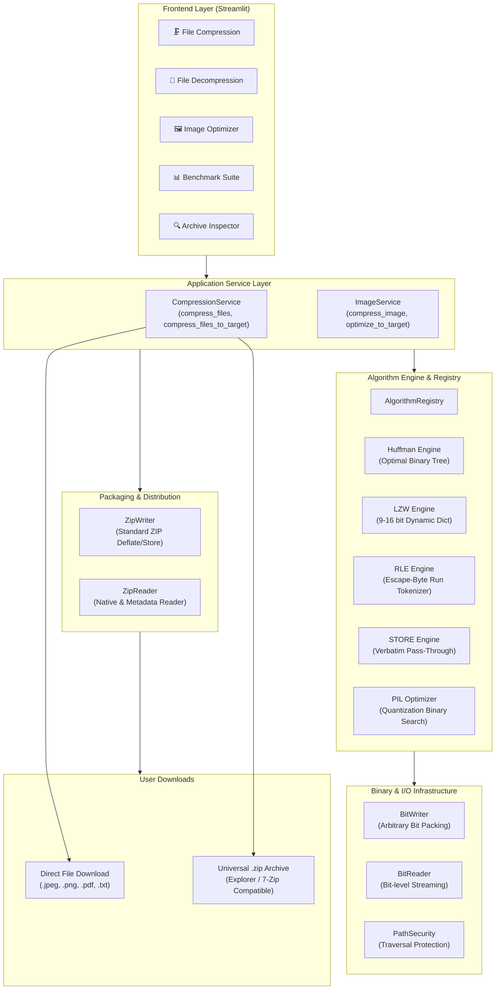
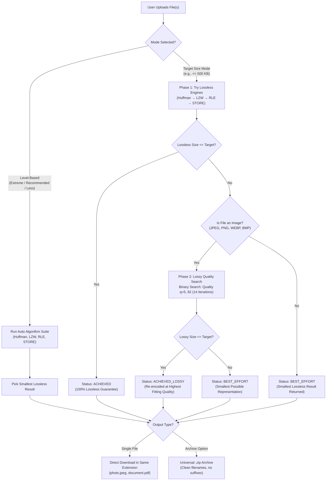

# ⚡ ZipForge

<div align="center">

### Adaptive Multi-Engine File Compressor & Image Optimizer

[](https://www.python.org/)
[](https://streamlit.io)
[](https://github.com/)
[](https://github.com/astral-sh/ruff)
[](https://en.wikipedia.org/wiki/ZIP_(file_format))
[](LICENSE)

<p align="center">
  <b>ZipForge</b> is a high-performance, open-source file compression platform that combines classical computer science algorithms with intelligent target-size optimization and clean universal ZIP archiving.
</p>

[Key Features](#-key-features) •
[Architecture](#-system-architecture) •
[Compression Pipeline](#-compression-decision-pipeline) •
[Algorithms](#-algorithm-deep-dive) •
[Getting Started](#-getting-started) •
[Project Structure](#-project-structure)

</div>

---

## 🌟 Overview

Most compression utilities hide their algorithms behind closed binaries. **ZipForge** opens the hood while delivering production-grade utility:

1. **Custom Algorithmic Engines**: Built-from-scratch implementations of **Huffman Coding**, **Lempel-Ziv-Welch (LZW)**, and **Run-Length Encoding (RLE)** operating on arbitrary binary streams with custom bit-level I/O.
2. **Auto-Algorithm Selection**: Automatically evaluates every algorithm against input data and chooses the strategy that yields the greatest reduction.
3. **Smart Target-Size Mode**: Need a file under 500 KB for an upload portal? ZipForge tries lossless algorithms first, then uses binary-search lossy re-encoding (for images) to hit your exact size budget.
4. **Direct Same-Extension Downloads**: Upload `.jpeg`, compress it, and download it directly as `.jpeg`—no unzipping required.
5. **Universal `.zip` Archive Output**: Multi-file archives are 100% compliant standard `.zip` files. When extracted with Windows Explorer, WinRAR, 7-Zip, or macOS Archive Utility, files retain their original names and open instantly.
6. **Defensive Security & Integrity**: SHA-256 checksum verification on every file, path traversal defense, and bounded memory execution.

---

## ✨ Key Features

| Feature | Description |
| :--- | :--- |
| ⚡ **Auto-Algorithm Engine** | Automatically tests Huffman, LZW, RLE, and STORE to select the optimal ratio per file. |
| 🎯 **Target-Size Budgeting** | Specify a target size in KB or MB; ZipForge guarantees output within budget. |
| 💾 **Same-Extension Downloads** | Single-file downloads preserve their original extension (`.jpg`, `.png`, `.pdf`, `.txt`). |
| 📦 **Universal ZIP Compatibility** | Clean `.zip` entries with no proprietary extensions or corrupting prefixes. |
| 🖼️ **Dedicated Image Optimizer** | Profile-based optimization (Web, Print, Thumbnail) with transparency preservation. |
| 📊 **Interactive Benchmark** | Side-by-side algorithm comparison with real-time compression ratios and execution times. |
| 🔍 **Zero-Extraction Inspector** | Inspect archive headers, entry count, compressed sizes, and SHA-256 without unpacking. |
| 🔒 **Enterprise-Grade Security** | Strict path sanitization, traversal defense, and SHA-256 cryptographic verification. |

---

## 🏗 System Architecture



---

## 🔄 Compression Decision Pipeline



---

## 🔬 Algorithm Deep Dive

### 1. Huffman Coding (`algorithms/huffman.py`)
* **Mathematical Foundation**: Builds an optimal prefix-free binary tree based on empirical byte frequencies.
* **Bitstream Packing**: Encodes variable-length bit sequences using custom `BitWriter` and `BitReader`.
* **Metadata Header**: Serializes the canonical frequency table so decompression reconstructs the identical tree.
* **Complexity**: $\mathcal{O}(N \log K)$ where $N$ is byte count and $K \le 256$ is alphabet size.

### 2. Lempel-Ziv-Welch (`algorithms/lzw.py`)
* **Dictionary Growth**: Dynamically builds a dictionary of phrase substrings on the fly.
* **Variable Bit-Width**: Starts at 9-bit codes and dynamically expands up to 16-bit codes ($65,536$ maximum entries) as the dictionary fills.
* **Dictionary Reset**: Automatically emits a reserved `CLEAR_CODE (256)` when the 16-bit dictionary limit is reached, resetting state and adapting to shifting data entropy.

### 3. Run-Length Encoding (`algorithms/rle.py`)
* **Escape Byte Protocol**: Uses an escape byte (`0xFE`) followed by run count and literal value to compress runs of $\ge 4$ identical bytes without penalizing non-repeating data.
* **Expansion Guard**: If input has high entropy with zero runs, automatically falls back to `STORE` to prevent file expansion.

### 4. Smart Target-Size Optimizer (`application/compression_service.py`)
* **Binary Search**: Evaluates image quality $q \in [5, 92]$ across 14 iterations to find the absolute highest visual quality that satisfies the user-defined byte threshold.
* **Format-Aware**: Preserves PNG alpha transparency by routing to optimized WEBP; routes opaque photos to baseline-optimized JPEG.

---

## 🚀 Getting Started

### Prerequisites
* **Python 3.11** or **Python 3.12+**
* `pip` package manager

### 1. Clone the Repository
```bash
git clone https://github.com/your-username/ZipForge.git
cd ZipForge
```

### 2. Create and Activate Virtual Environment (Recommended)
```powershell
# Windows (PowerShell)
python -m venv venv
.\venv\Scripts\Activate.ps1

# Linux / macOS
python3 -m venv venv
source venv/bin/activate
```

### 3. Install Dependencies
```bash
pip install -r requirements.txt
```

### 4. Run ZipForge
```bash
streamlit run app.py
```
The application will launch automatically in your browser at:
```text
http://localhost:8501
```

---

## 🧪 Running the Test Suite

ZipForge features a comprehensive test suite with 99 passing automated unit, integration, and security tests:

```bash
# Run all tests with short traceback
pytest tests/ -v

# Run tests with code coverage report
pytest --cov=. tests/
```

### Test Breakdown
* `test_zip_archive.py`: Clean entry names, universal ZIP validity, roundtrip extraction, target-size image preservation.
* `test_huffman.py`: Frequency analysis, optimal tree creation, variable-length bit encoding/decoding.
* `test_lzw.py`: Dictionary expansion, 9–16 bit transitions, clear code handling.
* `test_rle.py`: Escaped runs, single-byte runs, alternating entropy.
* `test_bit_io.py`: Sub-byte bit streams, arbitrary bit widths, padding validation.
* `test_image.py`: Target-size convergence, profile optimizations, format preservation.
* `test_archive.py`: Path traversal defense (`../`), drive letter removal, integrity checking.

---

## 📁 Project Structure

```text
ZipForge/
├── algorithms/                 # Custom Compression Engines
│   ├── __init__.py
│   ├── base.py                 # CompressionAlgorithm abstract base class
│   ├── huffman.py              # Canonical Huffman coding with bitstream I/O
│   ├── lzw.py                  # LZW with dynamic 9–16 bit dictionary
│   ├── rle.py                  # Run-Length Encoding with escape tokenizer
│   └── registry.py             # Algorithm registry & factory
├── application/                # Service Layer (Business Logic)
│   ├── __init__.py
│   ├── compression_service.py  # Lossless pipeline & target-size engine
│   └── image_service.py        # Profile & target-size image optimizer
├── archive/                    # Archive Packaging & Extraction
│   ├── __init__.py
│   ├── zip_writer.py           # Universal ZIP builder (clean entries, Deflate/Store)
│   └── zip_reader.py           # ZIP extractor & metadata inspector
├── binary/                     # Low-Level Bit Stream Handling
│   ├── __init__.py
│   ├── bit_reader.py           # Bit-level deserializer
│   └── bit_writer.py           # Bit-level serializer
├── filesystem/                 # Security & Path Sanitization
│   ├── __init__.py
│   └── security.py             # Traversal defense (zip slip prevention)
├── models/                     # Type Definitions & Data Structures
│   ├── __init__.py
│   ├── archive.py              # ArchiveEntry & ArchiveInspection
│   ├── compression.py          # CompressionResult & AlgorithmName
│   └── image.py                # ImageProfile & TargetStatus
├── tests/                      # 99-Test Automated Verification Suite
│   ├── test_archive.py
│   ├── test_bit_io.py
│   ├── test_huffman.py
│   ├── test_image.py
│   ├── test_lzw.py
│   ├── test_rle.py
│   └── test_zip_archive.py
├── app.py                      # Streamlit UI & Interactive Application
├── config.py                   # Centralized configuration & constants
├── exceptions.py               # Custom exception hierarchy
├── pyproject.toml              # Build config & tool configurations
├── requirements.txt            # Production dependencies
└── README.md                   # Project documentation
```

---

## 🔒 Security & Defensive Engineering

* **Zip Slip Defense**: Path traversal sequences (`../`, `..\`, absolute paths, drive letters `C:\`) are stripped and sanitized prior to extraction.
* **Cryptographic Integrity**: SHA-256 digests are computed for every file and embedded in archive metadata comments.
* **Allocation Limits**: Decompression routines enforce maximum entry caps ($65,535$ entries) and metadata bounds ($1\text{ MiB}$) to prevent zip bomb attacks.
* **Zero External Dependencies**: Core compression logic is pure Python standard library and Pillow—no unverified C-extensions or external binary blobs.

---

## 📄 License

This project is licensed under the **MIT License** — see the [LICENSE](LICENSE) file for details.
